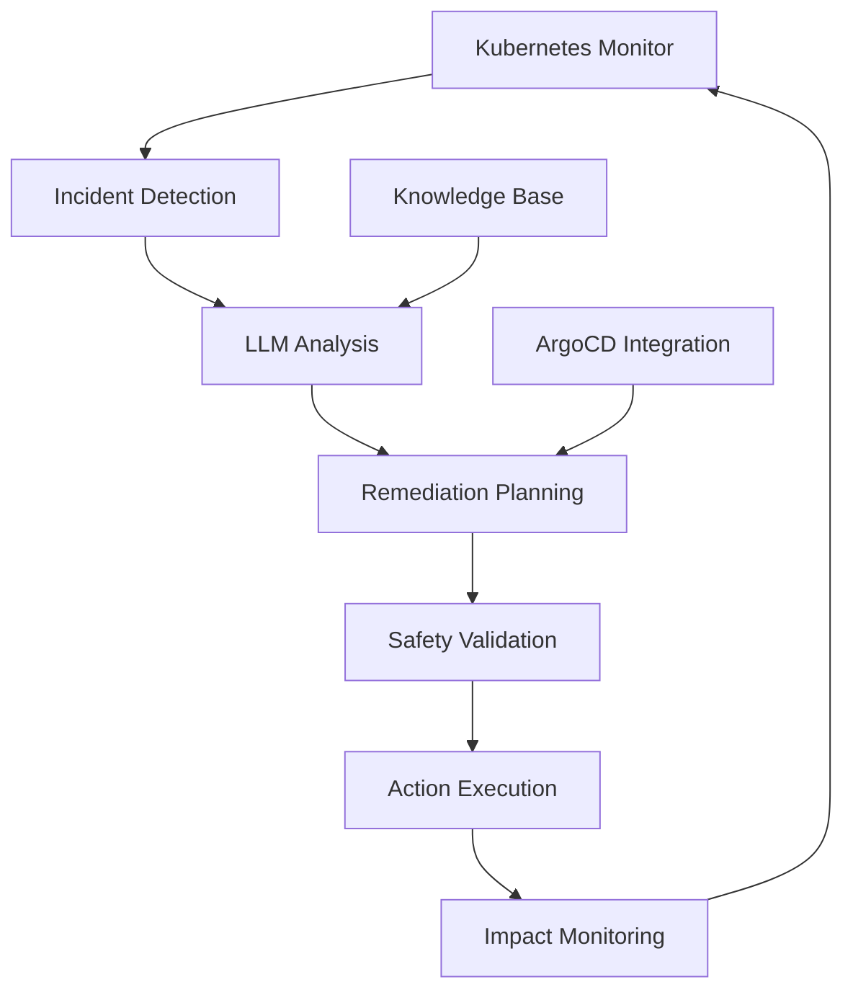

# LLM-Powered Kubernetes Incident Response System

An intelligent, automated incident response system that uses Large Language Models (LLMs) to analyze Kubernetes cluster issues and automatically remediate production incidents without manual intervention.

## 🚀 Features

- **Real-time Monitoring**: Continuously monitors Kubernetes cluster for incidents
- **LLM-Powered Analysis**: Uses OpenAI GPT-4 to analyze complex incident patterns
- **Automated Remediation**: Executes safe remediation actions automatically
- **ArgoCD Integration**: Integrates with ArgoCD for automated rollbacks and deployments  
- **Safety Controls**: Built-in safeguards to prevent destructive actions
- **Comprehensive Logging**: Detailed audit trail of all actions taken

## 🧠 How It Works



1. **Monitor**: Continuously scans pods, deployments, and services for issues
2. **Detect**: Identifies anomalies like crash loops, resource exhaustion, or failed deployments
3. **Analyze**: LLM examines logs, events, and metrics to understand root causes
4. **Plan**: Generates specific remediation actions with confidence scores
5. **Execute**: Safely performs actions like pod restarts, scaling, or rollbacks
6. **Monitor**: Observes impact and learns from outcomes

## 🏗️ Architecture

### Core Components

- **IncidentAnalyzer**: Main orchestration engine
- **KubernetesMonitor**: Cluster state monitoring and data collection
- **LLMIncidentAnalyzer**: OpenAI integration for intelligent analysis  
- **RemediationEngine**: Executes remediation actions
- **ArgoCDIntegration**: GitOps workflow management

### Supported Remediation Actions

- ✅ Pod restart (delete pod, let controller recreate)
- ✅ Horizontal scaling (increase/decrease replicas)
- ✅ Deployment rollback (revert to previous version)
- ✅ Configuration updates (ConfigMap/Secret patches)
- ✅ ArgoCD application sync/rollback
- ⚠️ Node draining (with safety checks)

## 📋 Prerequisites

- Kubernetes cluster (minikube, EKS, GKE, etc.)
- ArgoCD installed (optional but recommended)
- OpenAI API key (optional - system works with fallback rules)
- `kubectl` configured to access your cluster

## 🚀 Quick Start

### 1. Clone and Setup

```bash
cd llm
chmod +x setup.sh
./setup.sh
```

### 2. Configure OpenAI (Optional)

```bash
export OPENAI_API_KEY="your-openai-api-key"
kubectl create secret generic llm-incident-response-secrets \
  --from-literal=OPENAI_API_KEY="$OPENAI_API_KEY" \
  -n llm-incident-response
```

### 3. Configure ArgoCD Integration (Optional)

```bash
kubectl create secret generic llm-incident-response-secrets \
  --from-literal=ARGOCD_USERNAME="admin" \
  --from-literal=ARGOCD_PASSWORD="your-password" \
  -n llm-incident-response \
  --dry-run=client -o yaml | kubectl apply -f -
```

### 4. Verify Installation

```bash
kubectl logs -f deployment/llm-incident-response -n llm-incident-response
```

## 🧪 Testing the System

### Create Test Incidents

1. **Pod with Bad Image** (ImagePullBackOff):
```bash
kubectl run bad-image-pod --image=nonexistent-repo/bad-image:latest
```

2. **Crashing Pod** (CrashLoopBackOff):
```bash
kubectl run crashing-pod --image=busybox --command -- sh -c "exit 1"
```

3. **Resource Exhausted Pod**:
```bash
cat << EOF | kubectl apply -f -
apiVersion: v1
kind: Pod
metadata:
  name: memory-hog
spec:
  containers:
  - name: memory-hog
    image: busybox
    command: ["sh", "-c", "dd if=/dev/zero of=/tmp/memory.dat bs=1M count=1000"]
    resources:
      limits:
        memory: "100Mi"
EOF
```

### Monitor Remediation Actions

```bash
# Watch the incident response logs
kubectl logs -f deployment/llm-incident-response -n llm-incident-response

# Check for remediation actions
kubectl get events --sort-by='.lastTimestamp' -A
```

## ⚙️ Configuration

### Main Configuration

Edit the ConfigMap to customize behavior:

```bash
kubectl edit configmap llm-incident-response-config -n llm-incident-response
```

Key settings:
- `monitoring.scan_interval`: How often to check for incidents (seconds)
- `monitoring.confidence_threshold`: Minimum confidence to execute actions
- `remediation.enable_*`: Enable/disable specific remediation types
- `safety.excluded_namespaces`: Namespaces to never touch

### LLM Prompts

Customize how the LLM analyzes incidents by editing prompts in the ConfigMap.

## 🔒 Security & Safety

### Built-in Safety Features

- **Confidence Thresholds**: Only high-confidence actions are executed
- **Namespace Exclusions**: System namespaces are protected
- **Resource Limits**: Scaling has hard limits
- **Rate Limiting**: Maximum concurrent actions
- **Audit Logging**: All actions are logged with reasoning

### RBAC Permissions

The system uses minimal required permissions:
- Read access to pods, deployments, events
- Delete pods (for restarts)
- Patch deployments (for scaling/rollbacks)
- No access to secrets or cluster admin functions

## 📊 Monitoring & Observability

### View System Status

```bash
# Current incidents and actions
kubectl logs deployment/llm-incident-response -n llm-incident-response --tail=100

# System health
kubectl get pods -n llm-incident-response

# Recent actions in cluster
kubectl get events --sort-by='.lastTimestamp' -A
```

### Integration with Monitoring Tools

The system outputs structured logs that can be ingested by:
- Prometheus + Grafana
- ELK Stack
- Datadog
- New Relic

Example log output:
```json
{
  "timestamp": "2024-01-20T10:30:00Z",
  "level": "INFO", 
  "incident_id": "pod-crash-loop-uuid",
  "action": "restart_pod",
  "resource": "default/failing-pod",
  "confidence": 0.85,
  "reasoning": "Pod in CrashLoopBackOff with memory issues, restart likely to resolve"
}
```

## 🔧 Advanced Configuration

### Custom Remediation Actions

Extend the `RemediationEngine` class to add new actions:

```python
class CustomRemediationEngine(RemediationEngine):
    async def execute_custom_action(self, plan: RemediationPlan) -> bool:
        # Your custom remediation logic
        pass
```

### Custom LLM Prompts

Modify prompts in the ConfigMap to tune LLM behavior for your specific environment:

```yaml
data:
  prompts.yaml: |
    system_prompt: |
      You are an SRE for a fintech company with strict compliance requirements.
      All actions must be conservative and well-documented...
```

### Webhook Integration

Configure webhooks for notifications:

```yaml
alerting:
  enabled: true
  webhook_url: "https://hooks.slack.com/your-webhook"
```

## 🐛 Troubleshooting

### Common Issues

1. **System Not Detecting Incidents**
   - Check RBAC permissions
   - Verify pod can access Kubernetes API
   - Review scan interval configuration

2. **LLM Analysis Failing**
   - Verify OpenAI API key is set correctly
   - Check network connectivity to OpenAI
   - Monitor API rate limits

3. **Remediations Not Executing**
   - Check confidence threshold settings
   - Review safety exclusions
   - Verify resource permissions

### Debug Mode

Enable debug logging:

```bash
kubectl patch configmap llm-incident-response-config -n llm-incident-response \
  --patch '{"data":{"config.yaml":"logging:\n  level: DEBUG\n..."}}'
```

## 🤝 Contributing

1. Fork the repository
2. Create a feature branch
3. Add tests for new functionality  
4. Ensure all tests pass
5. Submit a pull request

### Running Tests

```bash
pip install -r requirements.txt
pytest tests/
```

## 📚 Architecture Deep Dive

### Decision Flow

```python
if incident.severity >= HIGH:
    if confidence_score >= 0.8:
        execute_immediately()
    elif confidence_score >= 0.6:
        request_approval()
    else:
        log_and_monitor()
```

### LLM Integration

The system uses structured prompts to ensure consistent LLM responses:

1. **Context Preparation**: Incident data formatted for LLM consumption
2. **Prompt Engineering**: Specific prompts for different incident types
3. **Response Parsing**: JSON extraction and validation
4. **Fallback Logic**: Rule-based analysis if LLM fails

## 📝 Roadmap

- [ ] Machine Learning model training from historical incidents
- [ ] Integration with more GitOps tools (Flux, Tekton)
- [ ] Custom resource definitions for incident policies
- [ ] Multi-cluster support
- [ ] Advanced anomaly detection using time-series analysis
- [ ] Integration with chaos engineering tools
- [ ] Self-healing infrastructure recommendations

## 📄 License

MIT License - see LICENSE file for details

## 🆘 Support

- Create an issue for bugs or feature requests
- Check existing issues for solutions
- Review logs for troubleshooting
- Join our Discord community for help

---

**⚠️ Important**: This system can automatically modify your Kubernetes cluster. Always test thoroughly in non-production environments first. Review all configuration and safety settings before deploying to production.
